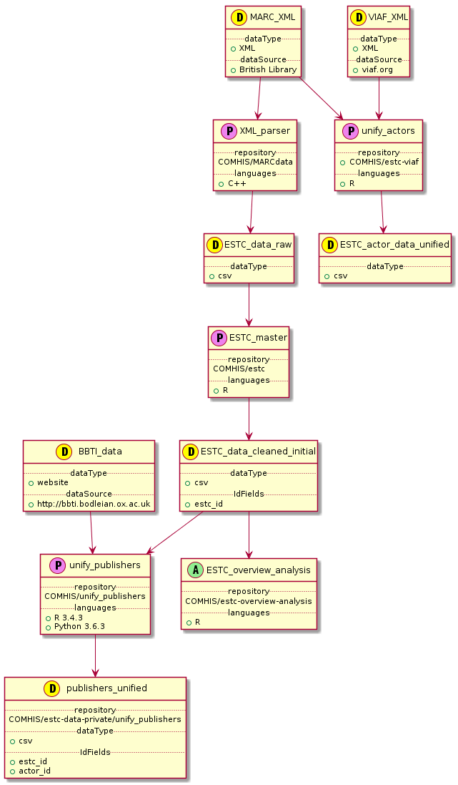

# Dependencies
UML chart of the overall workflow can be found [further down this document](#overall-workflow).

Dependencies for various data processing and analysis repositories can initially be collected here. If this file becomes too large, we can split it up by script. 
A dependency entry consists of:
* Script name
* input csv-file names and paths in [csv-data](https://github.com/COMHIS/estc-data-private)
* required input fields from that csv
* output csv-file names in [csv-data](https://github.com/COMHIS/estc-data-private)

Further documentation, such as field names and descriptions of the output data should go in the [data repository](https://github.com/COMHIS/estc-data-private).

## Data processing scripts

### Publishers data processing script
* _repository:_ [COMHIS/estc-publishers](https://github.com/COMHIS/estc-publishers)
* _input csv:_ this_is_not_the_real_path/estc_processed.csv
* _field names:_ Field1, Field2, Field3, ...
* _output csv:_ [COMHIS/estc-data-private/estc-publishers](https://github.com/COMHIS/estc-data-private/tree/master/estc-publishers)

### Authors (and other actors) data processing script
* _repository:_ [COMHIS/XXXXX](https://github.com/COMHIS/XXXXX)
* _input xml:_ this_is_not_the_real_path/estc.xml (https://github.com/COMHIS/estc-data-private/tree/master/XXXXXXXX)
* _output csv:_ [COMHIS/estc-data-private/XXXXX](https://github.com/COMHIS/estc-data-private/tree/master/XXXXX)

## Data analysis scripts

### This is just a placehold for an analysis script name
What should be here?

## Overall workflow
The UML chart is produced from PlantUML -standard file [dependencies.uml](./dependencies.uml). See [PlantUML](http://plantuml.com/) for details of the file format. The png image was done with a SublimeText UML -[plugin](https://github.com/jvantuyl/sublime_diagram_plugin).

<!--  -->

```
A - analysis
D - data
P - data processing
```
